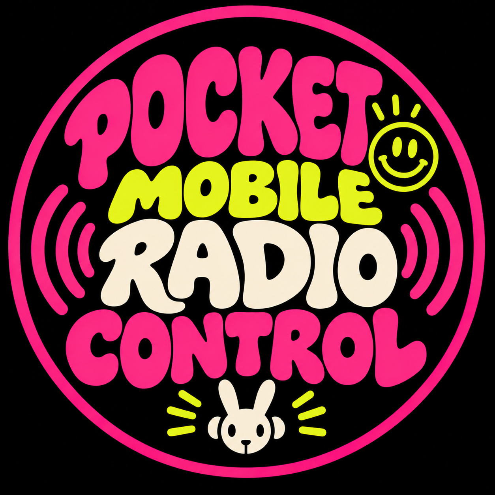

<p align="center">
  
</p>

# POCKET MOBILE RADIO CONTROL

**Mobile radio control for Pick Pocket Radio.**

A minimal mobile interface for controlling and speaking into **Pick Pocket Radio**, powered by **SONO PLAY MINI LIVE**.

## Four essential functions

- **CURRENT** — see the track currently on air
- **NEXT** — see the upcoming track
- **TALK** — push-to-talk voice intervention over the radio stream
- **LISTENERS** — live audience count in a dedicated visual block

A large **≫ NEXT** control skips to the next track.

## Philosophy

POCKET MOBILE RADIO CONTROL is not a full studio console. It is a small, immediate radio remote designed for a pocket device.

The first target device is the **Rabbit r1**, but the interface is device-independent and can later run on phones, tablets, or other small web-connected terminals.

`TALK` is an ephemeral intervention in the radio flow. It is **not a show**: it does not create a show entry, archive, or publication.

## Target interface

```text
┌────────────────────────────┐
│ PICK POCKET RADIO     ● AIR│
│                            │
│ CURRENT                    │
│ Artist — Track             │
│                            │
│ NEXT                       │
│ Artist — Next Track        │
│                            │
│ ┌──────────┐  ┌──────────┐ │
│ │   TALK   │  │  ≫ NEXT  │ │
│ └──────────┘  └──────────┘ │
│                            │
│ ┌──────────┐               │
│ │    12    │               │
│ │LISTENERS │               │
│ └──────────┘               │
└────────────────────────────┘
```

## TALK behaviour

```text
PRESS TALK
→ microphone ON
→ music ducks
→ voice goes on air

RELEASE TALK
→ microphone OFF
→ music returns
```

## Architecture

```text
POCKET MOBILE RADIO CONTROL
            │
       ┌────┴────┐
       │         │
      TALK     ≫ NEXT
       │         │
       ▼         ▼
 LIVE VOICE   SONO CONTROL
       │         │
       └────┬────┘
            ▼
   SONO PLAY MINI LIVE
            │
        LIQUIDSOAP
            │
         ICECAST
            │
    PICK POCKET RADIO
```

## Current development status

**Candidate / test phase.**

The existing control prototype already provides CURRENT, NEXT, listener information, and SONO NEXT control. The next milestone is the mobile Rabbit-oriented version followed by push-to-talk audio integration.

Development is validated against a test stream before any change is promoted to the public Pick Pocket Radio stream.

## Ecosystem

- **Pick Pocket Radio** — the radio station
- **SONO PLAY MINI LIVE** — broadcast and automation engine
- **POCKET MOBILE RADIO CONTROL** — mobile remote + push-to-talk interface
- **Rabbit r1** — first target device

**MIND YOUR CULTURE.**
